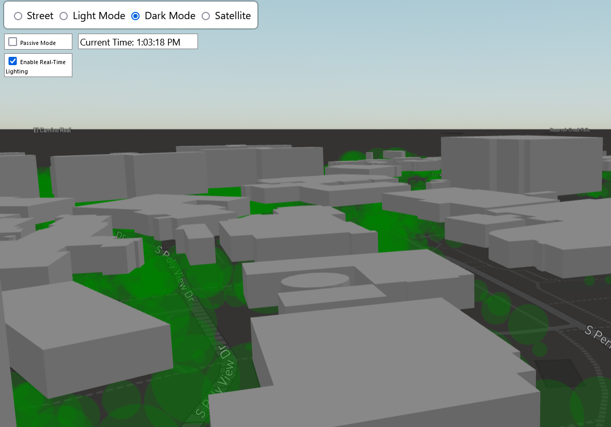

# Cal Poly Campus Ride

This is a 3D visualization of Cal Poly's campus using [threebox](https://github.com/jscastro76/threebox). Data was sourced using [openstreetmap](https://www.openstreetmap.org) and the [Cal Poly Tree Map](https://www.arcgis.com/apps/View/index.html?appid=4ada4763be0c4aa6a5d0acd2cc32ba8d)

## Setup

Threebox is available as an npm package, installed via the following.

`npm i threebox-plugin`

You will also need to get a mapbox API token, and put it into a file called `config.js` which is in the following format:

```js
var config = {
    accessToken: 'ACCESS_TOKEN_HERE'
};
```

To run the application, start up an http server using python3. It is necessary to do so in the folder where the html file is housed.

`python3 -m http.server 8000`

A localhost server on port 8000 should be started up. For a starting position, use [this](http://localhost:8000/render.html#18.23/35.296834/-120.664407/13.6/60) url (Note: it will only work if you have started the application).

## Methodology

### Data Processing

Data was extracted from openstreetmap and the Cal Poly Tree map. Building data was extracted via the following python code snippet.

```python3
place_name = "California Polytechnic State University, San Luis Obispo"
tags = {'building': True}

gdf = ox.geometries_from_place(place_name, tags)

def convert_complex_types(df):
    for col in df.columns:
        if df[col].dtype == object:
            df[col] = df[col].apply(lambda x: ', '.join(map(str, x)) if isinstance(x, list) else x)
    return df
    
gdf.to_file("calpoly_buildings.geojson", driver="GeoJSON")
```

Using the python osmnx API, data on cal poly buildings were cleaned into geojson objects which can be rendered in the future. This is important as certain buildings had incompatible types (i.e. 'Point' or 'MultiPolygon') which could not be rendered properly. It was important for the geojson file to be uniform in geometry type.

Similarly, the Tree Map geojson was attained using ArcGIS viewer. Some minor pre-processing had to be done as coordinates were not well-formed, but this was easily achieved using tools such as those present in [mygeodata](https://mygeodata.cloud/).

### Tree Representation

Trees are represented as green circles of varying size based on their provided height. As will be discussed in the **Limitations** section, certain issues with rendering meant that using 3D models or even `THREE.js` meshes & objects would prove infeasible.

## Modes

Two main modes are present in this visualization, named "Active" and "Passive" mode.

### Active Mode

In active mode, the user can take control of a drone and fly around Cal Poly's campus. The drone starts off at a height slightly above that of Baker Science. `W`/`S` keys are used to move the drone back and forth, and `A`/`D` keys are used to rotate the drone. In addition, the `Z` and `X` keys are used to lower and raise the drone's height, respectively. The player is not limited to the confines of Cal Poly campus, but no buildings exist outside of those.

Movement code was adapted from the [20-game example](https://github.com/jscastro76/threebox/tree/master/examples) in the threebox repository. Slight modifications were made to allow for height changing and the initial orientation of the drone.

It is heavily recommended to select Dark Mode for active mode.

### Passive Mode

Passive mode, when checked, enables terrain and allows the user to freely move around the landscape. Users are not locked to a camera view and are free to roam around. Using `Ctrl` + `Click` allows the user to change the direction the camera is viewing.

## Features

Outside of the aforementioned active & passive mode, this application contains a few other features, shown in the table below.

| Building Tooltips | Real-Time Sky | Map Modes | Toggle Lighting |
|----------|----------|----------|----------|
|    |   |    |  |

## Limitations

Unfortunately, limitations of the threebox library meant that the initial desired scope of the project had to be thinned down a bit.

An unfortunate quirk of the library is that when a terrain layer is activated, 3D models loaded via a `custom` layer will not load properly. This does not just include externally sourced 3D assets, but also includes meshes like cylinders, prisms, and cubes loaded via THREE.js. Hence, a passive mode was added to allow for the rendering of terrain sans drone.

### Tree Rendering

This also meant that adding actual tree models, which was initially in scope of this project, would not be possible. The Cal Poly tree map represents trees as `Points` which consist of coordinates and an associated `exact_height` which represents the height of a tree. Points cannot be extruded in a `fill-extrusion` layer as there is no base polygon to extrude to a certain height. There were two possible solutions, both of which didn't make much sense.

1) Render trees as green cylinders, and either just have a circle representation in passive mode or scrap passive mode all together. Neither solution suffices as it introduces needless inconsistency between modes or removes an interesting feature of the application.

2) Create a script to modify the JSON to change the feature type to `Polygon` and add a `Geometry` section with 4 points, all +/- `0.00014` from the center stated in the point. Further modifications would have to be made to add/remove features present in Polygon geometries but not in Point ones. This runs the likely risk of creating a deformed geojson file, which would be tedious to debug.

As it wouldn't make sense for one mode to have 3D trees and the other to not have them, a compromise was devised where trees would be represented as circles of varying size based on their height. While it does envelop the campus when zoomed out, the purpose of the application is to provide a close up view of Cal Poly's campus.

### Passive Mode

Passive mode was added due to the aforementioned limitations. 3D models render at application initialization, but quickly disappear once all extrusions are rendered. Hence, terrain needed to be removed in order to allow the user to move around with the drone on Cal Poly campus.